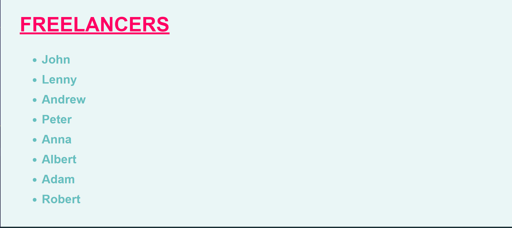

# Freelancer-Forum

Fullstack Academy block20 Freelancer Forum Workshop

## Table of contents

- [Overview](#overview)
  - [The challenge](#the-challenge)
  - [Screenshot](#screenshot)
  - [Links](#links)
  - [Built with](#built-with)
  - [What I learned](#what-i-learned)
  - [Continued development](#continued-development)
  - [Author](#author)
- [Acknowledgments](#acknowledgments)

## Overview

### The challenge

1. Take an array of 'users' with name, age, and occupation (index.js)
2. Create an index.html file with a div with an ID of "root"
3. Connect the .js to the .html file
4. In the main function: Add an h1 element with text of "FREELANCERS",
   append it to the html document.
   Create an unordered list element
   Loop through the users array creating li elements
   preferably with the name property
   Append those elements to html document
5. Style the site with CSS

### Screenshot



### Links

- Live Site URL: [Add live site URL here](https://your-live-site-url.com)

## My process

### Built with

- Javascript
- Internal CSS

### What I learned

Adding text in the form of an unordered list to an html file
from a javascript array using Document Object Model and functions

```js
some js code I thought was cool

for (let i = 0; i < users.length; i++){   //loop through the users array creating li elements (list)
  let list = document.createElement("li")
  list.innerText = users[i].name
};
```

### Continued development

I will continue to focus on learning more javascript

## Author

- Website -Clea Carty(https://www.linkedin.com/in/clea-carty-50930a26/)

## Acknowledgments

Special thanks to Frank Chambergo of Fullstack Academy who helped with displaying list text
